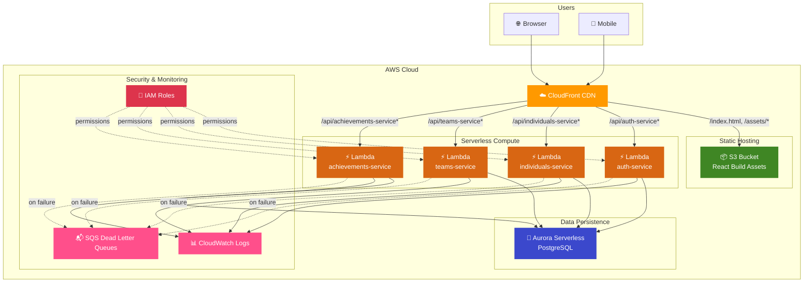
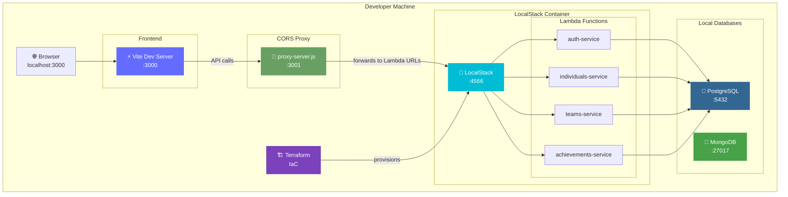

# ACME TeamHub — Cloud Architecture

## AWS Serverless Architecture

```mermaid
graph TB
    subgraph Users["Users"]
        Browser["🌐 Browser"]
        Mobile["📱 Mobile"]
    end

    subgraph AWS["AWS Cloud"]
        CF["☁️ CloudFront CDN"]

        subgraph S3Layer["Static Hosting"]
            S3["📦 S3 Bucket<br/>React Build Assets"]
        end

        subgraph LambdaLayer["Serverless Compute"]
            AUTH["⚡ Lambda<br/>auth-service"]
            IND["⚡ Lambda<br/>individuals-service"]
            TEAM["⚡ Lambda<br/>teams-service"]
            ACH["⚡ Lambda<br/>achievements-service"]
        end

        subgraph DataLayer["Data Persistence"]
            RDS["🐘 Aurora Serverless<br/>PostgreSQL"]
        end

        subgraph Security["Security & Monitoring"]
            IAM["🔐 IAM Roles"]
            CW["📊 CloudWatch Logs"]
            SQS["📬 SQS Dead Letter Queues"]
        end
    end

    Browser --> CF
    Mobile --> CF
    CF -->|"/index.html, /assets/*"| S3
    CF -->|"/api/auth-service*"| AUTH
    CF -->|"/api/individuals-service*"| IND
    CF -->|"/api/teams-service*"| TEAM
    CF -->|"/api/achievements-service*"| ACH

    AUTH --> RDS
    IND --> RDS
    TEAM --> RDS
    ACH --> RDS

    AUTH --> CW
    IND --> CW
    TEAM --> CW
    ACH --> CW

    AUTH -.->|"on failure"| SQS
    IND -.->|"on failure"| SQS
    TEAM -.->|"on failure"| SQS
    ACH -.->|"on failure"| SQS

    IAM -.->|"permissions"| AUTH & IND & TEAM & ACH

    style CF fill:#FF9900,color:#fff,stroke:none
    style S3 fill:#3F8624,color:#fff,stroke:none
    style AUTH fill:#D86613,color:#fff,stroke:none
    style IND fill:#D86613,color:#fff,stroke:none
    style TEAM fill:#D86613,color:#fff,stroke:none
    style ACH fill:#D86613,color:#fff,stroke:none
    style RDS fill:#3B48CC,color:#fff,stroke:none
    style SQS fill:#FF4F8B,color:#fff,stroke:none
    style CW fill:#FF4F8B,color:#fff,stroke:none
    style IAM fill:#DD344C,color:#fff,stroke:none
```

## Local Development Architecture

```mermaid
graph TB
    subgraph Dev["Developer Machine"]
        Browser["🌐 Browser<br/>localhost:3000"]

        subgraph Frontend["Frontend"]
            Vite["⚡ Vite Dev Server<br/>:3000"]
        end

        subgraph Proxy["CORS Proxy"]
            ProxySrv["🔄 proxy-server.js<br/>:3001"]
        end

        subgraph LocalStack["LocalStack Container"]
            LS["🐳 LocalStack<br/>:4566"]

            subgraph Lambdas["Lambda Functions"]
                LA["auth-service"]
                LI["individuals-service"]
                LT["teams-service"]
                LAC["achievements-service"]
            end
        end

        subgraph Databases["Local Databases"]
            PG["🐘 PostgreSQL<br/>:5432"]
            MG["🍃 MongoDB<br/>:27017"]
        end

        TF["🏗️ Terraform<br/>IaC"]
    end

    Browser --> Vite
    Vite -->|"API calls"| ProxySrv
    ProxySrv -->|"forwards to Lambda URLs"| LS
    LS --> LA & LI & LT & LAC
    LA & LI & LT & LAC --> PG
    TF -->|"provisions"| LS

    style Vite fill:#646CFF,color:#fff,stroke:none
    style ProxySrv fill:#68A063,color:#fff,stroke:none
    style LS fill:#00BCD4,color:#fff,stroke:none
    style PG fill:#336791,color:#fff,stroke:none
    style MG fill:#47A248,color:#fff,stroke:none
    style TF fill:#7B42BC,color:#fff,stroke:none
```
