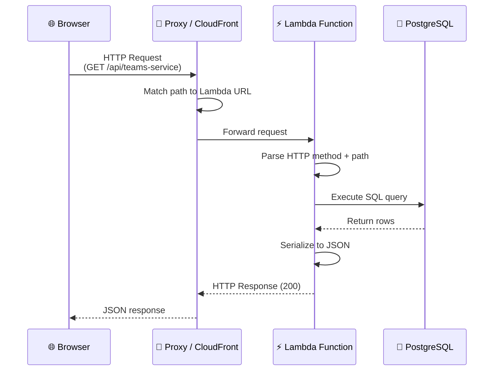
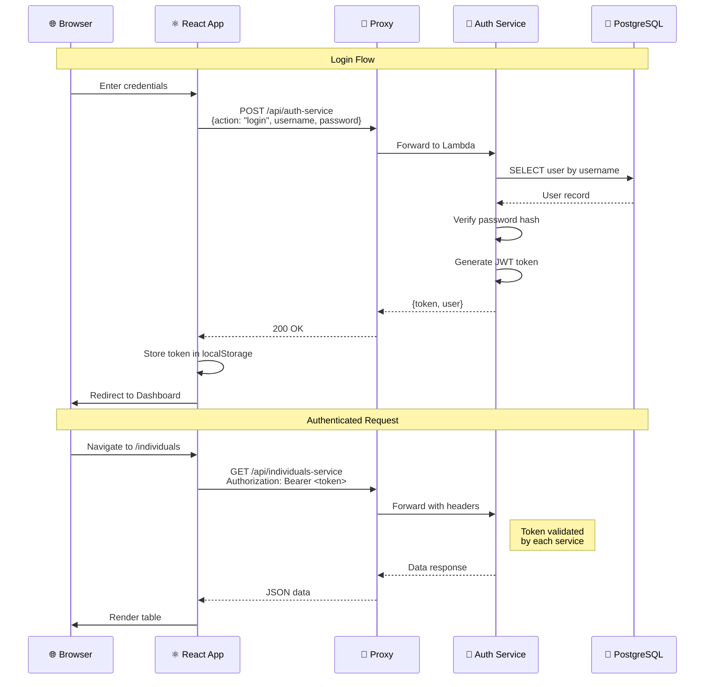
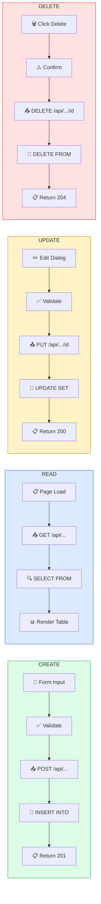
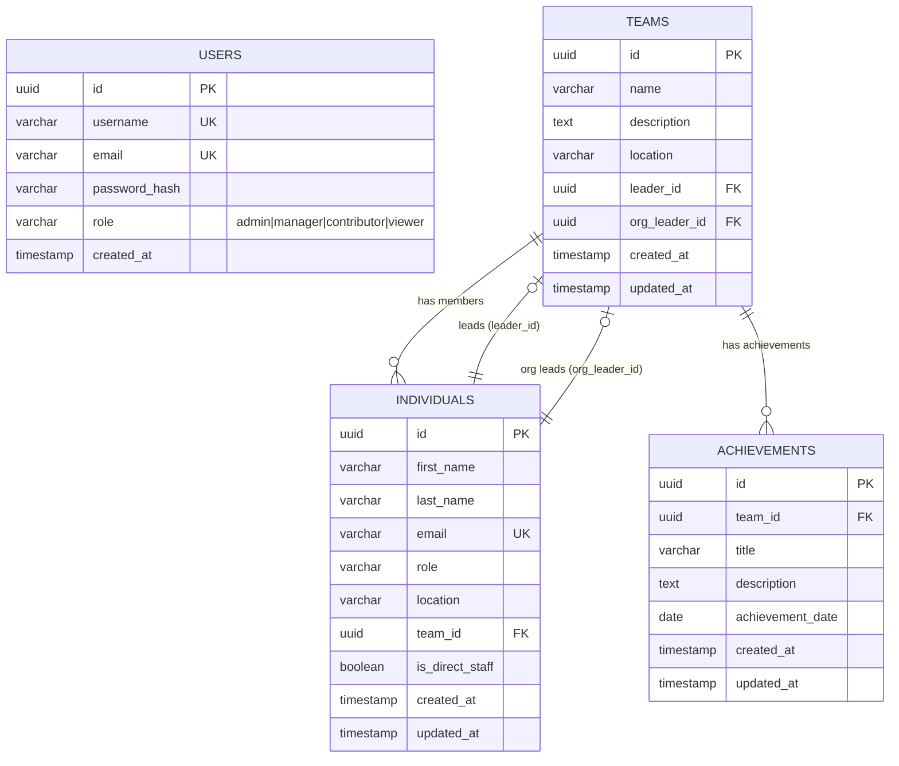

# ACME TeamHub — Data Flow Diagrams

## API Request Flow

```mermaid
sequenceDiagram
    participant U as 🌐 Browser
    participant P as 🔄 Proxy / CloudFront
    participant L as ⚡ Lambda Function
    participant DB as 🐘 PostgreSQL

    U->>P: HTTP Request<br/>(GET /api/teams-service)
    P->>P: Match path to Lambda URL
    P->>L: Forward request
    L->>L: Parse HTTP method + path
    L->>DB: Execute SQL query
    DB-->>L: Return rows
    L->>L: Serialize to JSON
    L-->>P: HTTP Response (200)
    P-->>U: JSON response
```

## Authentication Flow

```mermaid
sequenceDiagram
    participant U as 🌐 Browser
    participant F as ⚛️ React App
    participant P as 🔄 Proxy
    participant A as 🔐 Auth Service
    participant DB as 🐘 PostgreSQL

    Note over U,DB: Login Flow
    U->>F: Enter credentials
    F->>P: POST /api/auth-service<br/>{action: "login", username, password}
    P->>A: Forward to Lambda
    A->>DB: SELECT user by username
    DB-->>A: User record
    A->>A: Verify password hash
    A->>A: Generate JWT token
    A-->>P: {token, user}
    P-->>F: 200 OK
    F->>F: Store token in localStorage
    F->>U: Redirect to Dashboard

    Note over U,DB: Authenticated Request
    U->>F: Navigate to /individuals
    F->>P: GET /api/individuals-service<br/>Authorization: Bearer <token>
    P->>A: Forward with headers
    Note right of A: Token validated<br/>by each service
    A-->>P: Data response
    P-->>F: JSON data
    F->>U: Render table
```

## CRUD Data Flow

```mermaid
flowchart LR
    subgraph Create["CREATE"]
        C1["📝 Form Input"] --> C2["✅ Validate"] --> C3["📤 POST /api/..."] --> C4["💾 INSERT INTO"] --> C5["📋 Return 201"]
    end

    subgraph Read["READ"]
        R1["📋 Page Load"] --> R2["📤 GET /api/..."] --> R3["🔍 SELECT FROM"] --> R4["📊 Render Table"]
    end

    subgraph Update["UPDATE"]
        U1["✏️ Edit Dialog"] --> U2["✅ Validate"] --> U3["📤 PUT /api/.../id"] --> U4["💾 UPDATE SET"] --> U5["📋 Return 200"]
    end

    subgraph Delete["DELETE"]
        D1["🗑️ Click Delete"] --> D2["⚠️ Confirm"] --> D3["📤 DELETE /api/.../id"] --> D4["💾 DELETE FROM"] --> D5["📋 Return 204"]
    end

    style Create fill:#dcfce7,stroke:#16a34a
    style Read fill:#dbeafe,stroke:#2563eb
    style Update fill:#fef3c7,stroke:#d97706
    style Delete fill:#fee2e2,stroke:#dc2626
```

## Data Relationships

```mermaid
erDiagram
    USERS {
        uuid id PK
        varchar username UK
        varchar email UK
        varchar password_hash
        varchar role "admin|manager|contributor|viewer"
        timestamp created_at
    }

    TEAMS {
        uuid id PK
        varchar name
        text description
        varchar location
        uuid leader_id FK
        uuid org_leader_id FK
        timestamp created_at
        timestamp updated_at
    }

    INDIVIDUALS {
        uuid id PK
        varchar first_name
        varchar last_name
        varchar email UK
        varchar role
        varchar location
        uuid team_id FK
        boolean is_direct_staff
        timestamp created_at
        timestamp updated_at
    }

    ACHIEVEMENTS {
        uuid id PK
        uuid team_id FK
        varchar title
        text description
        date achievement_date
        timestamp created_at
        timestamp updated_at
    }

    TEAMS ||--o{ INDIVIDUALS : "has members"
    TEAMS ||--o{ ACHIEVEMENTS : "has achievements"
    INDIVIDUALS ||--o| TEAMS : "leads (leader_id)"
    INDIVIDUALS ||--o| TEAMS : "org leads (org_leader_id)"
```
