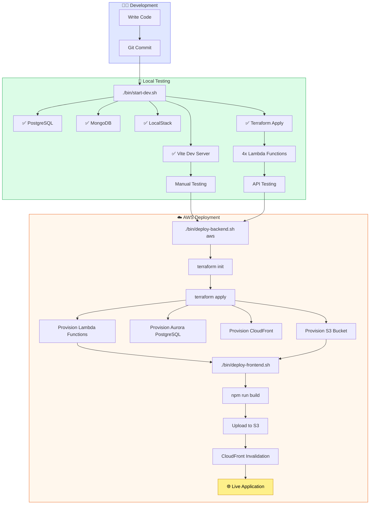
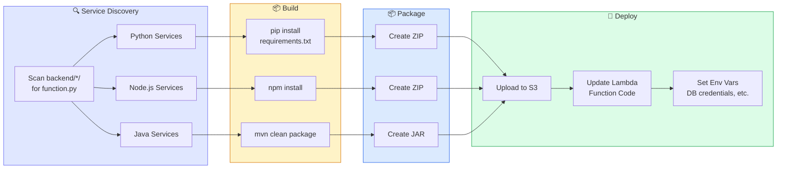
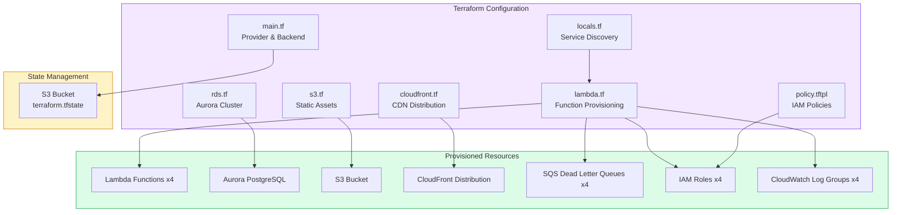

# ACME TeamHub — CI/CD & Deployment Pipelines

## Deployment Pipeline Overview

```mermaid
flowchart TB
    subgraph Dev["👨‍💻 Development"]
        Code["Write Code"] --> Commit["Git Commit"]
    end

    subgraph LocalTest["🧪 Local Testing"]
        Commit --> StartDev["./bin/start-dev.sh"]
        StartDev --> PG["✅ PostgreSQL"]
        StartDev --> MG["✅ MongoDB"]
        StartDev --> LS["✅ LocalStack"]
        StartDev --> TF["✅ Terraform Apply"]
        StartDev --> FE["✅ Vite Dev Server"]
        TF --> LambdaDeploy["4x Lambda Functions"]
        FE --> ManualTest["Manual Testing"]
        LambdaDeploy --> CurlTest["API Testing"]
    end

    subgraph CloudDeploy["☁️ AWS Deployment"]
        ManualTest --> BackendDeploy["./bin/deploy-backend.sh aws"]
        CurlTest --> BackendDeploy
        BackendDeploy --> TFInit["terraform init"]
        TFInit --> TFApply["terraform apply"]
        TFApply --> ProvisionLambda["Provision Lambda Functions"]
        TFApply --> ProvisionRDS["Provision Aurora PostgreSQL"]
        TFApply --> ProvisionCF["Provision CloudFront"]
        TFApply --> ProvisionS3["Provision S3 Bucket"]

        ProvisionLambda --> FrontendDeploy["./bin/deploy-frontend.sh"]
        ProvisionS3 --> FrontendDeploy
        FrontendDeploy --> BuildReact["npm run build"]
        BuildReact --> S3Upload["Upload to S3"]
        S3Upload --> InvalidateCF["CloudFront Invalidation"]
        InvalidateCF --> Live["🌐 Live Application"]
    end

    style Dev fill:#e0e7ff,stroke:#6366f1
    style LocalTest fill:#dcfce7,stroke:#16a34a
    style CloudDeploy fill:#fff7ed,stroke:#ea580c
    style Live fill:#fef08a,stroke:#ca8a04,color:#000
```

## Backend Deployment Pipeline

```mermaid
flowchart LR
    subgraph Discovery["🔍 Service Discovery"]
        Scan["Scan backend/*/<br/>for function.py"]
        Scan --> Python["Python Services"]
        Scan --> Node["Node.js Services"]
        Scan --> Java["Java Services"]
    end

    subgraph Build["📦 Build"]
        Python --> PipInstall["pip install<br/>requirements.txt"]
        Node --> NpmInstall["npm install"]
        Java --> MvnBuild["mvn clean package"]
    end

    subgraph Package["📦 Package"]
        PipInstall --> ZipPy["Create ZIP"]
        NpmInstall --> ZipNode["Create ZIP"]
        MvnBuild --> ZipJava["Create JAR"]
    end

    subgraph Deploy["🚀 Deploy"]
        ZipPy --> S3["Upload to S3"]
        ZipNode --> S3
        ZipJava --> S3
        S3 --> UpdateLambda["Update Lambda<br/>Function Code"]
        UpdateLambda --> ConfigEnv["Set Env Vars<br/>DB credentials, etc."]
    end

    style Discovery fill:#e0e7ff,stroke:#6366f1
    style Build fill:#fef3c7,stroke:#d97706
    style Package fill:#dbeafe,stroke:#2563eb
    style Deploy fill:#dcfce7,stroke:#16a34a
```

## Infrastructure as Code Flow

```mermaid
flowchart TB
    subgraph TFConfig["Terraform Configuration"]
        Main["main.tf<br/>Provider & Backend"]
        Locals["locals.tf<br/>Service Discovery"]
        Lambda["lambda.tf<br/>Function Provisioning"]
        RDS["rds.tf<br/>Aurora Cluster"]
        S3["s3.tf<br/>Static Assets"]
        CF["cloudfront.tf<br/>CDN Distribution"]
        Policy["policy.tftpl<br/>IAM Policies"]
    end

    subgraph State["State Management"]
        StateS3["S3 Bucket<br/>terraform.tfstate"]
    end

    subgraph Resources["Provisioned Resources"]
        LambdaR["Lambda Functions x4"]
        RDSR["Aurora PostgreSQL"]
        S3R["S3 Bucket"]
        CFR["CloudFront Distribution"]
        SQSR["SQS Dead Letter Queues x4"]
        IAMR["IAM Roles x4"]
        CWR["CloudWatch Log Groups x4"]
    end

    Main --> StateS3
    Locals --> Lambda
    Lambda --> LambdaR
    Lambda --> SQSR
    Lambda --> IAMR
    Lambda --> CWR
    RDS --> RDSR
    S3 --> S3R
    CF --> CFR
    Policy --> IAMR

    style TFConfig fill:#f3e8ff,stroke:#7c3aed
    style State fill:#fef3c7,stroke:#d97706
    style Resources fill:#dcfce7,stroke:#16a34a
```
