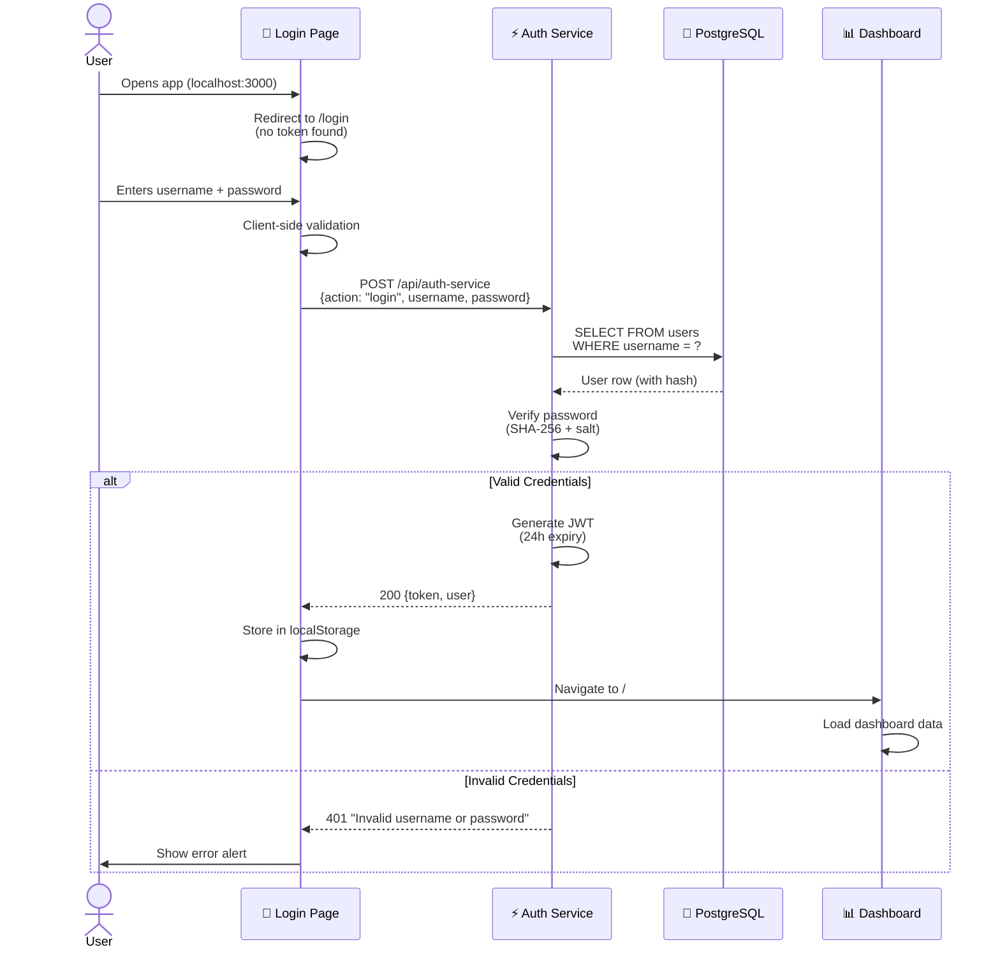
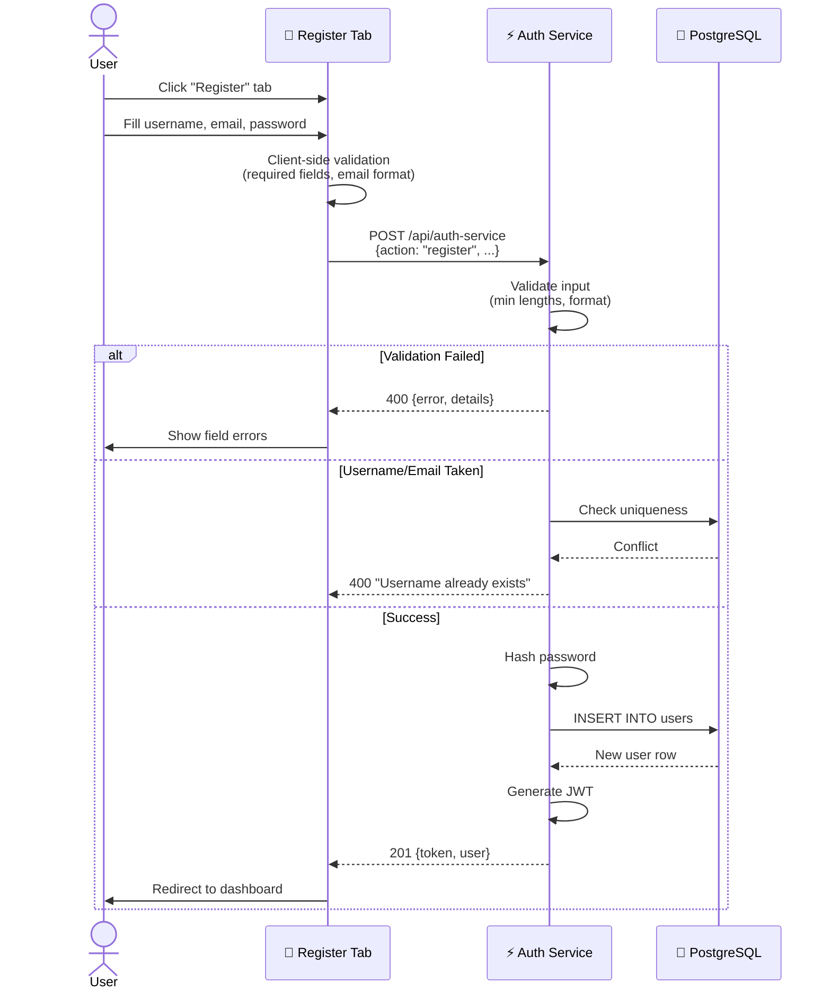
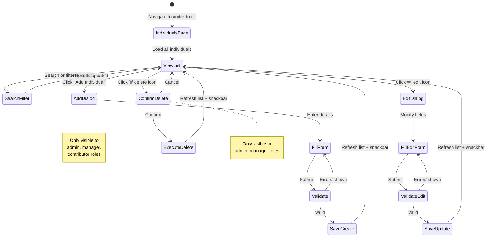
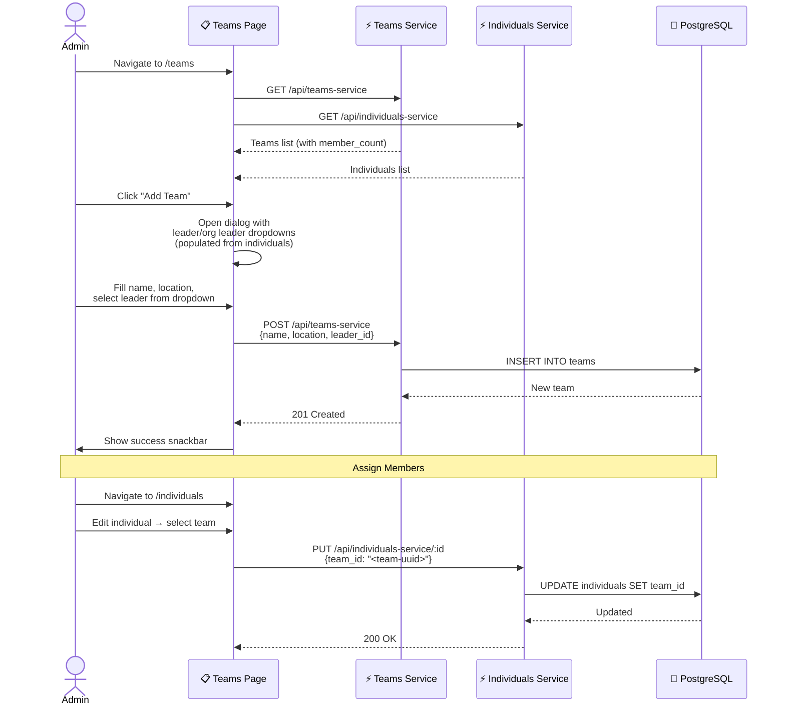
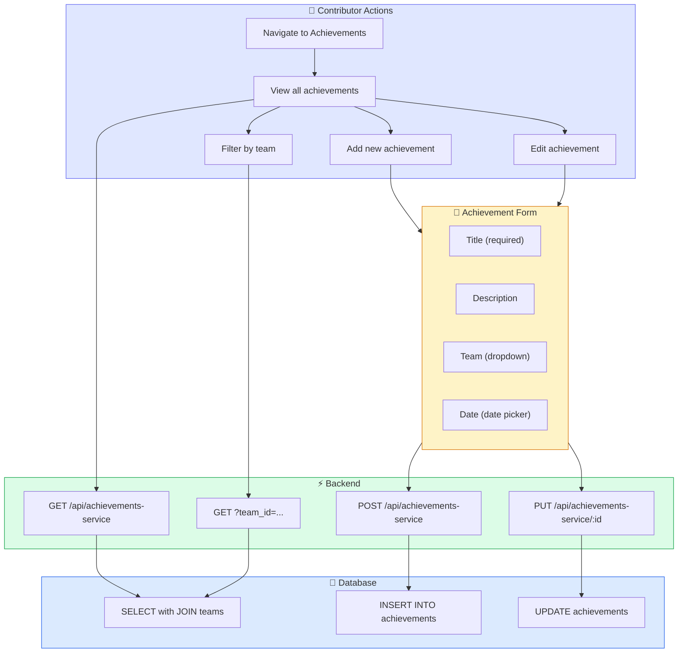
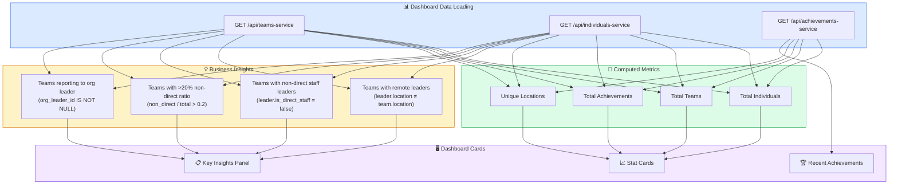
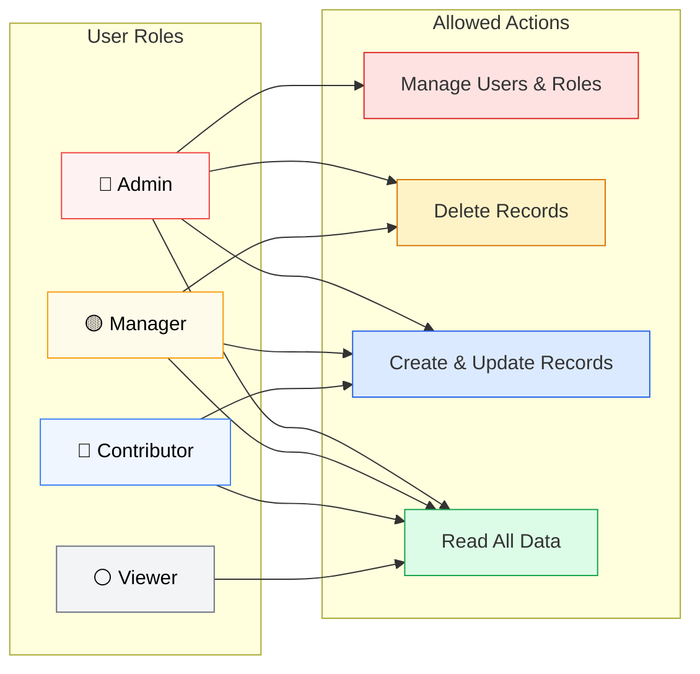
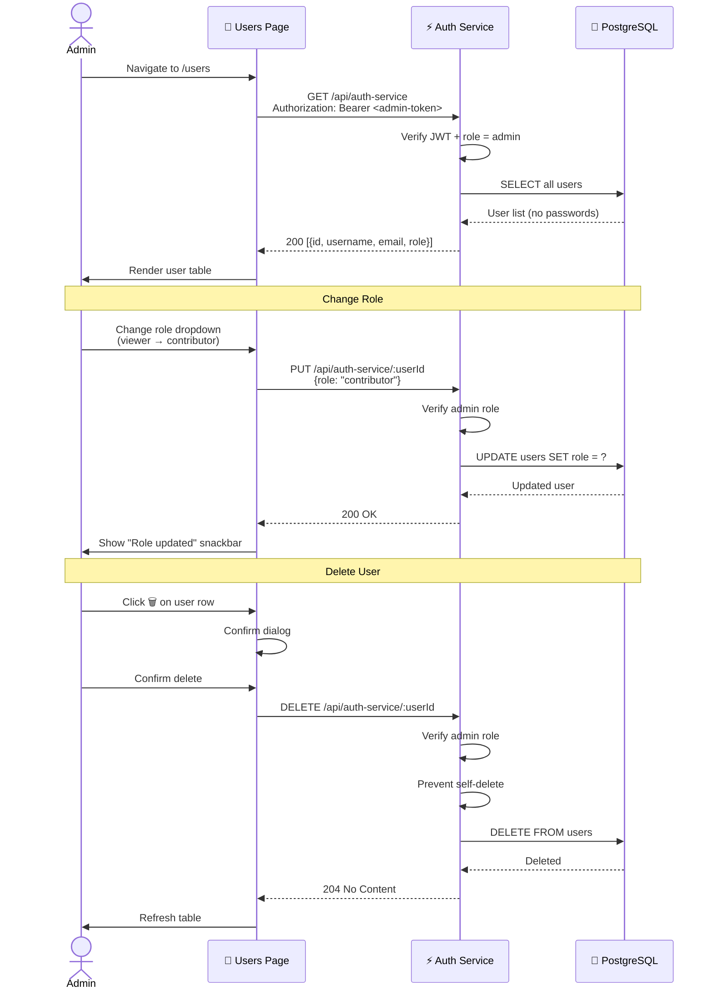

# ACME TeamHub — User Story Diagrams

## US-1: User Authentication

> *As a user, I want to log in with my credentials so that I can access the team management platform.*

## US-2: New User Registration

> *As a new user, I want to register an account so that I can start using the platform.*

## US-3: Managing Team Members (CRUD)

> *As a manager, I want to add, edit, and remove team members so that I can keep our roster up to date.*

## US-4: Team Structure Management

> *As an admin, I want to create teams, assign leaders, and track org structure so that I can manage the organization hierarchy.*

## US-5: Tracking Achievements

> *As a contributor, I want to record team achievements so that we can track our progress over time.*

## US-6: Dashboard Business Insights

> *As a manager, I want to see key metrics about our organization so I can make data-driven decisions.*

## US-7: Role-Based Access Control

> *As an admin, I want to control what each user role can do so that data integrity is maintained.*

## US-8: Admin User Management

> *As an admin, I want to manage user accounts and change roles so that I can control access.*

